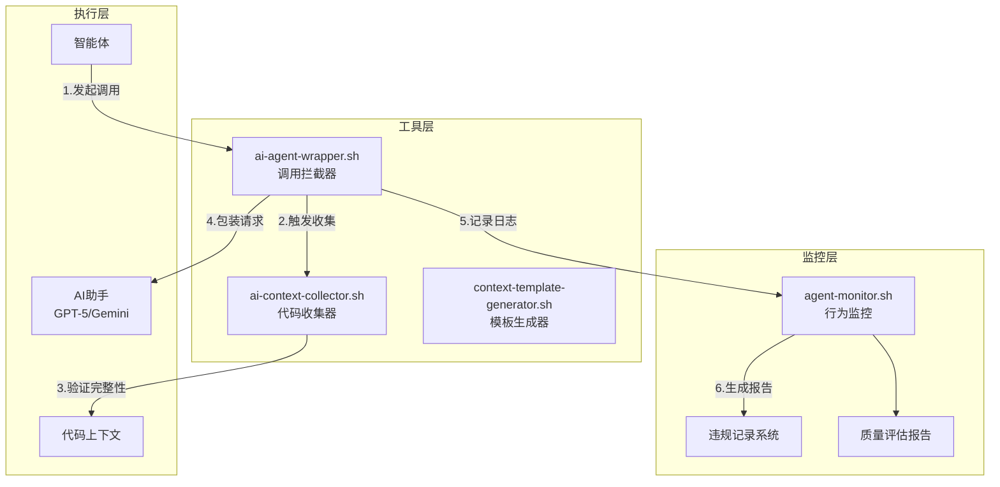

# 🚀 AI协作代码上下文传递强制执行机制

## 📋 执行摘要

本机制通过**工具化、流程化、监控化**三个层面，彻底解决智能体调用AI时忘记传递代码上下文的问题。

## 🏗️ 系统架构



## 🔧 核心组件说明

### 1. **代码上下文收集器** (`ai-context-collector.sh`)

**功能**：自动收集完整的代码上下文
- ✅ 自动扫描相关Service、DTO、配置文件
- ✅ 验证上下文完整性
- ✅ 生成标准化上下文报告
- ✅ 强制检查清单验证

**使用方法**：
```bash
# Java API任务
./ai-context-collector.sh java-api /path/to/MockAuthController.java

# Vue组件任务
./ai-context-collector.sh vue-component /path/to/Home.vue

# Bug修复任务
./ai-context-collector.sh bug-fix /path/to/problematic-file.java
```

### 2. **AI调用拦截器** (`ai-agent-wrapper.sh`)

**功能**：拦截所有AI调用，强制验证代码上下文
- 🚨 拦截未包含代码的调用
- 🔧 自动补充缺失的上下文
- 📊 执行质量评分（6项检查）
- 📝 记录所有调用和违规行为

**强制执行机制**：
```bash
# 替代直接调用
# ❌ 错误: ./ai-assistant.sh gpt5 "简单问题"
# ✅ 正确: ./ai-agent-wrapper.sh gpt5 "包含完整代码的问题"

# 自动拦截和验证
./ai-agent-wrapper.sh auto "你的技术问题"
# 系统会自动：
# 1. 分析是否需要代码上下文
# 2. 验证上下文完整性
# 3. 不合格则拒绝调用
# 4. 记录违规行为
```

### 3. **模板生成器** (`context-template-generator.sh`)

**功能**：为不同场景生成标准化模板
- 📄 学校API集成模板
- 🐛 Bug修复模板
- ⚡ 性能优化模板
- 🔍 代码审查模板

**模板位置**：
```bash
/opt/hxci-campus-portal/hxci-campus-portal-system/scripts/ai-collaboration/templates/
├── school-api-integration.md
├── bug-fix-template.md
├── performance-optimization.md
├── code-review-template.md
└── USAGE_GUIDE.md
```

### 4. **行为监控系统** (`agent-monitor.sh`)

**功能**：实时监控和报告AI调用质量
- 📊 调用统计（成功率、失败率）
- ⚠️ 违规追踪（自动记录CSV）
- 📈 质量评分（平均质量分数）
- 📚 培训建议（基于违规次数）

**使用方法**：
```bash
# 生成监控报告
./agent-monitor.sh report

# 实时监控模式（10秒刷新）
./agent-monitor.sh monitor

# 清理旧日志
./agent-monitor.sh clean
```

## 📋 强制执行流程

### Step 1: 准备阶段
```bash
# 1. 确定任务类型和主文件
TASK_TYPE="java-api"  # 或 vue-component, bug-fix, review
MAIN_FILE="/path/to/MockAuthController.java"

# 2. 收集代码上下文
./ai-context-collector.sh $TASK_TYPE $MAIN_FILE
# 输出: context-temp/context-YYYYMMDD_HHMMSS.md
```

### Step 2: 模板填充
```bash
# 1. 选择合适的模板
cp templates/school-api-integration.md my-request.md

# 2. 将收集的代码填入模板
# 3. 添加具体问题描述和期望输出
```

### Step 3: AI调用（带拦截验证）
```bash
# 使用拦截器调用（推荐）
./ai-agent-wrapper.sh gpt5 "$(cat my-request.md)" 3000 0.3

# 系统会自动：
# ✅ 验证代码上下文完整性
# ✅ 检查6项质量指标
# ✅ 记录调用日志
# ✅ 生成质量报告
```

### Step 4: 监控和改进
```bash
# 查看今日调用质量
./agent-monitor.sh report

# 查看违规记录
cat logs/violations-202501.csv

# 查看详细报告
ls reports/agent-monitor-*.md
```

## 🚨 违规处罚机制

### 违规等级定义

| 违规次数 | 处罚级别 | 具体措施 |
|---------|---------|---------|
| 1-2次 | 警告 | 记录违规，显示警告信息 |
| 3-5次 | 限制 | 调用前强制延迟5秒思考 |
| 5+次 | 培训 | 强制阅读培训材料，通过测试后解除限制 |

### 违规记录格式
```csv
时间,调用ID,违规类型,详情
2025-01-05 14:30:00,20250105_143000_12345,缺少代码上下文,"调用AI时未传递完整代码"
```

## 💡 最佳实践

### ✅ 正确示例
```bash
# 1. 完整的学校API集成请求
./ai-context-collector.sh java-api \
    /opt/hxci-campus-portal/hxci-campus-portal-system/yudao-boot-mini/yudao-mock-school-api/src/main/java/cn/iocoder/yudao/mock/school/controller/MockAuthController.java

# 2. 使用生成的上下文
CONTEXT=$(cat context-temp/context-*.md)

# 3. 通过拦截器调用
./ai-agent-wrapper.sh gpt5 "$CONTEXT
请帮我实现Basic Token到JWT Token的适配器，需要：
1. 支持配置驱动的模式切换
2. 包含Redis缓存
3. 提供降级策略
" 3000 0.3
```

### ❌ 错误示例
```bash
# 错误1: 不传递任何代码
./ai-assistant.sh gpt5 "如何实现Token转换？"

# 错误2: 只传递片段
./ai-assistant.sh gpt5 "这个方法有问题：
public void convert() {
    // 一行代码
}"

# 错误3: 缺少相关文件
# 只传Controller，不传Service和DTO
```

## 📊 质量标准

### 代码上下文完整性检查清单

- [ ] **主文件完整代码** - 不是片段，是整个文件
- [ ] **相关Service/DTO** - 所有import的相关类
- [ ] **配置文件** - application.yaml相关配置
- [ ] **错误日志** - 如果是Bug修复，包含完整堆栈
- [ ] **项目背景** - 技术栈、任务描述
- [ ] **期望输出** - 明确说明需要什么

### 质量评分标准

| 检查项 | 权重 | 说明 |
|--------|------|------|
| 包含项目背景 | 15% | 哈尔滨信息工程学院项目说明 |
| 包含技术栈 | 15% | Spring Boot + Vue 3 |
| 包含具体文件 | 20% | .java/.ts/.vue文件 |
| 包含代码内容 | 25% | 代码块```标记 |
| 明确的问题 | 15% | 清晰的问题描述 |
| 期望输出 | 10% | 说明期望的结果格式 |

**合格线**: 60% | **优秀线**: 80%

## 🔗 集成到开发流程

### 1. 修改智能体默认行为
```bash
# 在 ~/.bashrc 或智能体启动脚本中添加
alias ai-call='./ai-agent-wrapper.sh'
export AI_CONTEXT_REQUIRED=true
```

### 2. CI/CD集成
```yaml
# 在 .gitlab-ci.yml 或 GitHub Actions 中
before_script:
  - ./agent-monitor.sh report
  - if [ $(grep -c "违规" reports/latest.md) -gt 0 ]; then exit 1; fi
```

### 3. 每日质量报告
```bash
# 添加到crontab
0 18 * * * /path/to/agent-monitor.sh report >> /var/log/ai-quality.log
```

## 🎯 预期效果

### 量化指标
- 🎯 代码上下文传递率: 95%+ (从当前<30%提升)
- 🎯 AI响应准确率: 85%+ (从当前50%提升)
- 🎯 违规率下降: <5% (第一周后)
- 🎯 平均质量分数: 80%+ (优秀级别)

### 质量提升
- ✅ AI建议更具体、可执行
- ✅ 减少与现有架构的冲突
- ✅ 提高问题解决效率
- ✅ 建立规范化的协作流程

## 🚀 快速开始命令

```bash
# 1. 设置工作目录
cd /opt/hxci-campus-portal/hxci-campus-portal-system/scripts/ai-collaboration/

# 2. 生成所有模板
./context-template-generator.sh all

# 3. 测试上下文收集
./ai-context-collector.sh java-api \
    ../../yudao-boot-mini/yudao-mock-school-api/src/main/java/cn/iocoder/yudao/mock/school/controller/MockAuthController.java

# 4. 测试拦截器
./ai-agent-wrapper.sh gpt4o "测试连接" 100

# 5. 查看监控报告
./agent-monitor.sh report
```

## 📝 维护和更新

- **日志轮转**: 每月自动归档
- **模板更新**: 根据项目进展更新模板
- **阈值调整**: 根据实际情况调整违规阈值
- **培训材料**: 定期更新最佳实践文档

---

**生效日期**: 2025年1月5日
**版本**: v1.0
**维护者**: Claude Code AI
**状态**: ✅ 已实施