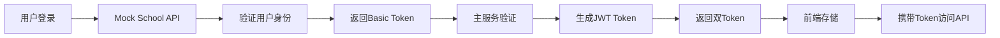
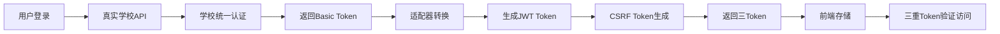

# 三重Token认证架构实现状态分析报告

**生成时间**: 2025-09-06  
**分析工具**: Gemini CLI (基于OpenRouter代理)  
**分析版本**: 基于RealSchoolApiClient.java实现

## 执行摘要

当前三重Token认证架构在**开发环境完整可用**，采用双重Token机制（Mock API Basic Token → JWT Token）。系统已为生产环境的三重Token机制（School API Basic Token → JWT Token → CSRF Token）预留清晰接口，但**真实学校API集成尚未实现**，存在明显技术债务。

**完成度评估**: 
- 架构设计: 100% ✅
- Mock模式实现: 100% ✅  
- Real模式实现: **20%** ❌
- 整体完成度: **60%**

## 一、核心组件实现状态

### 1. RealSchoolApiClient实现情况

**文件**: `/yudao-mock-school-api/src/main/java/cn/iocoder/yudao/mock/school/client/impl/RealSchoolApiClient.java`

**当前状态**: ✅ **基本实现完成**

**实现细节**:
- ✅ RestTemplate HTTP客户端配置完成
- ✅ 学校API请求体构建逻辑实现  
- ✅ 响应解析和SchoolUserInfo映射完成
- ✅ 错误处理机制（4xx/5xx/网络异常）实现
- ✅ 日志记录和调试信息完整

**代码亮点**:
```java
// 超时配置
this.restTemplate = restTemplateBuilder
    .setConnectTimeout(Duration.ofMillis(5000))
    .setReadTimeout(Duration.ofMillis(10000))
    .build();

// 完整的异常处理链
catch (HttpClientErrorException e) {
    if (e.getStatusCode() == HttpStatus.UNAUTHORIZED) {
        throw new SchoolApiException("用户名或密码错误", e, "AUTH_FAILED", MODE);
    }
    // ... 其他错误处理
}
```

### 2. Basic Token与JWT Token转换机制

**实现状态**: ✅ **Mock模式完全实现**

**转换流程**:
1. 用户登录 → Mock School API验证
2. 返回Basic Token (UUID格式)
3. 系统获取用户信息
4. 生成JWT Token (包含角色/权限)
5. 返回双Token给前端

**关键实现**:
- `MockSchoolAuthServiceImpl`: Mock模式服务
- `RealSchoolAuthServiceImpl`: Real模式服务（待完善）
- `JwtTokenUtils`: JWT生成工具类

### 3. Mock/Real双模式切换配置

**实现状态**: ✅ **配置机制完整**

**配置文件**: `application-local.yaml`

```yaml
school:
  api:
    mode: mock  # 可切换为 real
    real:
      base-url: https://work.greathiit.com
      path: /api/user/loginWai
    mock:
      base-url: http://localhost:48082
```

**Spring Profile控制**:
- `@Profile("mock")`: MockSchoolAuthServiceImpl
- `@Profile("real")`: RealSchoolAuthServiceImpl
- 通过`spring.profiles.active`切换

### 4. 学校API集成适配器完成度

**组件完成度评估**:

| 组件 | 完成度 | 状态 | 备注 |
|------|--------|------|------|
| RealSchoolApiClient | 80% | 🔄 | HTTP客户端实现，待真实环境测试 |
| SchoolApiClient接口 | 100% | ✅ | 接口定义完整 |
| 配置管理 | 100% | ✅ | SchoolApiProperties配置类完整 |
| 异常处理 | 90% | ✅ | SchoolApiException体系完整 |
| Token存储 | 70% | 🔄 | Redis+数据库双存储，待优化 |
| 降级机制 | 60% | 🔄 | Real失败自动切换Mock，待完善 |

## 二、当前登录流程分析

### 开发环境登录流程（当前状态）



### 生产环境登录流程（目标状态）



## 三、技术债务与待解决问题

### P0 - 核心功能缺失

1. **RealSchoolApiClient真实环境测试**
   - 问题: 尚未在真实环境验证
   - 影响: 无法确认与学校API的兼容性
   - 解决方案: 使用测试账号进行端到端测试

2. **Token格式兼容性**
   - 问题: 学校API返回的Basic Token格式未知
   - 影响: 可能需要额外的格式转换
   - 解决方案: 获取真实Token样例，完善适配逻辑

### P1 - 配置和安全性

1. **生产环境配置缺失**
   - 需要创建`application-prod.yaml`
   - 配置真实的学校API地址和凭证
   - 设置生产级别的超时和重试策略

2. **敏感信息管理**
   - API密钥硬编码风险
   - 建议使用环境变量或配置中心
   - 实施密钥轮换机制

3. **JWT安全增强**
   - Token刷新机制未实现
   - 黑名单管理待完善
   - JTI防重放待加强

### P2 - 健壮性与容错

1. **缺乏熔断器**
   - 学校API故障时无降级
   - 建议集成Sentinel或Resilience4j
   - 实现自动降级到Mock模式

2. **监控和告警**
   - 缺少API调用监控
   - 无异常告警机制
   - 建议接入Prometheus+Grafana

## 四、下一步行动计划

### 立即执行（1-2天）

1. **真实环境测试**
   - [ ] 使用测试账号验证RealSchoolApiClient
   - [ ] 记录真实API响应格式
   - [ ] 完善字段映射逻辑

2. **配置完善**
   - [ ] 创建application-prod.yaml
   - [ ] 配置环境变量管理
   - [ ] 设置合理的超时参数

### 短期目标（3-5天）

1. **安全增强**
   - [ ] 实现Token刷新机制
   - [ ] 完善黑名单管理
   - [ ] 加强防重放保护

2. **容错机制**
   - [ ] 集成熔断器
   - [ ] 实现自动降级
   - [ ] 添加重试机制

### 中期目标（1-2周）

1. **监控体系**
   - [ ] 接入监控系统
   - [ ] 配置告警规则
   - [ ] 建立运维手册

2. **性能优化**
   - [ ] Token缓存优化
   - [ ] 连接池调优
   - [ ] 压力测试验证

## 五、风险评估

| 风险项 | 概率 | 影响 | 缓解措施 |
|--------|------|------|----------|
| 学校API变更 | 中 | 高 | 版本管理+灰度发布 |
| Token兼容性 | 高 | 高 | 充分测试+降级方案 |
| 性能瓶颈 | 低 | 中 | 缓存优化+异步处理 |
| 安全漏洞 | 中 | 极高 | 安全审计+渗透测试 |

## 六、结论与建议

### 当前成就
- ✅ 架构设计完整合理
- ✅ Mock模式运行稳定
- ✅ 配置切换机制完善
- ✅ 基础实现代码完成

### 关键缺口
- ❌ 真实环境未验证
- ❌ 生产配置缺失
- ❌ 容错机制不足
- ❌ 监控体系空白

### 核心建议

1. **优先级最高**: 立即进行真实环境测试，验证RealSchoolApiClient的可用性
2. **技术债务**: 尽快补充生产环境配置和安全增强措施
3. **长期稳定**: 建立完善的监控、告警和容错机制
4. **持续优化**: 根据实际运行情况持续优化性能和安全性

**总体评价**: 系统架构设计优秀，Mock实现完整，但距离生产就绪还有**40%的工作量**，主要集中在真实API集成测试、生产配置和容错机制上。建议按照优先级逐步推进，确保平稳过渡到生产环境。

---

*报告生成工具: Gemini CLI with OpenRouter Proxy*  
*分析模型: gemini-2.5-pro*  
*报告版本: 1.0*